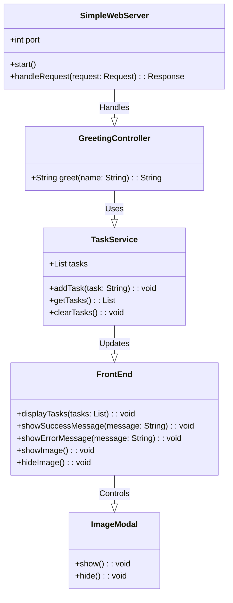
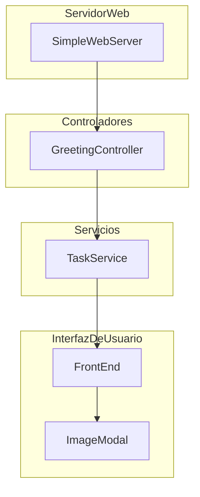

# AREP LAB 3 Arquitecturas de Servidores de Aplicaciones, Meta protocolos de objetos, Patrón IoC, Reflexión

Este proyecto es una implementación de un servidor web básico en Java que incluye un marco de Inversión de Control (IoC), manejo de reflexiones y un front-end sencillo. La aplicación permite la gestión de tareas y la visualización de imágenes a través de una interfaz web.

## Funcionalidades

- **Añadir Tareas**: Permite ingresar y añadir tareas a una lista.
- **Mostrar/ Ocultar Tareas**: Alterna entre mostrar y ocultar la lista de tareas.
- **Borrar Tareas**: Borra todas las tareas de la lista.
- **Mostrar Imagen**: Muestra una imagen en un modal.

## Estructura del Proyecto

- `src/main/java/org/example/SpringEci/`:
  - **Anotaciones**: `@GetMapping`, `@RequestMapping`, `@RequestParam`, `@RestController`.
  - **Controladores**: `GreetingController`.
  - **Servidor Web**: `SimpleWebServer`, `SpringECI`.

- `src/main/resources/`:
  - Archivos estáticos: `index.html`, `styles.css`, `scripts.js`, `favicon.png`, `tanque.png`.

- `src/test/java/org/example/TestEci/`:
  - **Framework de Pruebas**: `JUnit`, `TestClass`, `Reflection`, `Main`, `Test`.

## Cómo Ejecutar

### 1. Descargar el Proyecto:

    git clone https://github.com/sebastian2929/AREP_LAB03.git

### 2. Compilar el Proyecto:

    mvn clean install

### 3. Ejecutar el Servidor Web: Después de compilar el proyecto, ejecuta el servidor web utilizando el siguiente comando

    java -cp target/classes org.example.SpringEci.SimpleWebServer
El servidor web estará disponible en http://localhost:8080/

### 4. Ejecutar Pruebas: Para ejecutar las pruebas unitarias, utiliza el siguiente comando:

    java -cp target/classes org.example.TestEci.JUnit org.example.TestEci.TestClass

## Arquitectura del Proyecto

Este proyecto está diseñado con una arquitectura modular que combina un servidor web en Java con un front-end básico. La arquitectura sigue los principios de **Inversión de Control (IoC)** y utiliza **reflexión** para la gestión de componentes. A continuación, se detalla cada componente y su función en el sistema:

### 1. Servidor Web en Java

El servidor web está implementado en Java y se encarga de servir tanto los archivos estáticos (como HTML, CSS, JavaScript e imágenes) como de gestionar las solicitudes REST. Utiliza una clase llamada `SimpleWebServer` para manejar las conexiones y rutas definidas.

- **Clase `SimpleWebServer`**:
  - Escucha las solicitudes HTTP entrantes en el puerto especificado.
  - Mapea las solicitudes a métodos específicos basados en el tipo de solicitud (GET, POST, DELETE).
  - Sirve archivos estáticos desde el directorio de recursos.
  - Integra un marco básico de IoC para la gestión de componentes y anotaciones.

- **Clase `SpringECI`**:
  - Maneja la inicialización del servidor y la configuración de las rutas.
  - Utiliza reflexión para cargar y registrar los POJOs anotados con `@RestController`.

### 2. Controladores y Servicios

- **Controladores**:
  - **`GreetingController`**: Un ejemplo de controlador que maneja solicitudes REST utilizando anotaciones como `@GetMapping` y `@RequestParam`.

- **Servicios**:
  - Los servicios se definen como POJOs y son registrados automáticamente por el marco de IoC. Estos servicios se encargan de la lógica de negocio y se inyectan en los controladores según sea necesario.

### 3. Front-End

La interfaz de usuario se compone de:

- **HTML (`index.html`)**: La página principal que contiene el formulario para añadir tareas, botones para gestionar las tareas y mostrar la imagen, y un modal para la imagen.
- **CSS (`styles.css`)**: Estilos para darle formato y diseño a la página web. Se utilizan fuentes de Google Fonts y se definen estilos para los botones, el formulario y el modal.
- **JavaScript (`scripts.js`)**: Lógica de cliente que maneja las interacciones del usuario, como añadir tareas, mostrar u ocultar la lista de tareas, y controlar el modal de la imagen. También maneja la visualización de mensajes de éxito y error.

### 4. Manejo de Tareas y Modal

- **Gestión de Tareas**:
  - **Añadir Tareas**: Permite al usuario ingresar nuevas tareas que se almacenan en una lista en el cliente.
  - **Mostrar/Ocultar Tareas**: Alterna la visibilidad de la lista de tareas.
  - **Borrar Tareas**: Permite borrar todas las tareas de la lista.

- **Modal de Imagen**:
  - Se utiliza para mostrar una imagen en una ventana emergente. El modal es controlado con JavaScript y se oculta o muestra basado en las acciones del usuario.

### 5. Pruebas

El proyecto incluye pruebas para verificar el correcto funcionamiento de las funcionalidades. Utiliza un enfoque de pruebas unitarias personalizadas con una clase `JUnit` para validar los componentes del servidor y las funcionalidades de la interfaz web.

## Diagramas

### 1. Diagrama de clases

### 2. Diagrama de componentes

## Pruebas

## Contacto

Autor: Sebastián David Blanco Rodríguez

## Licencia

Este proyecto está licenciado bajo la Licencia MIT. Consulta el archivo `LICENSE` para más detalles.
